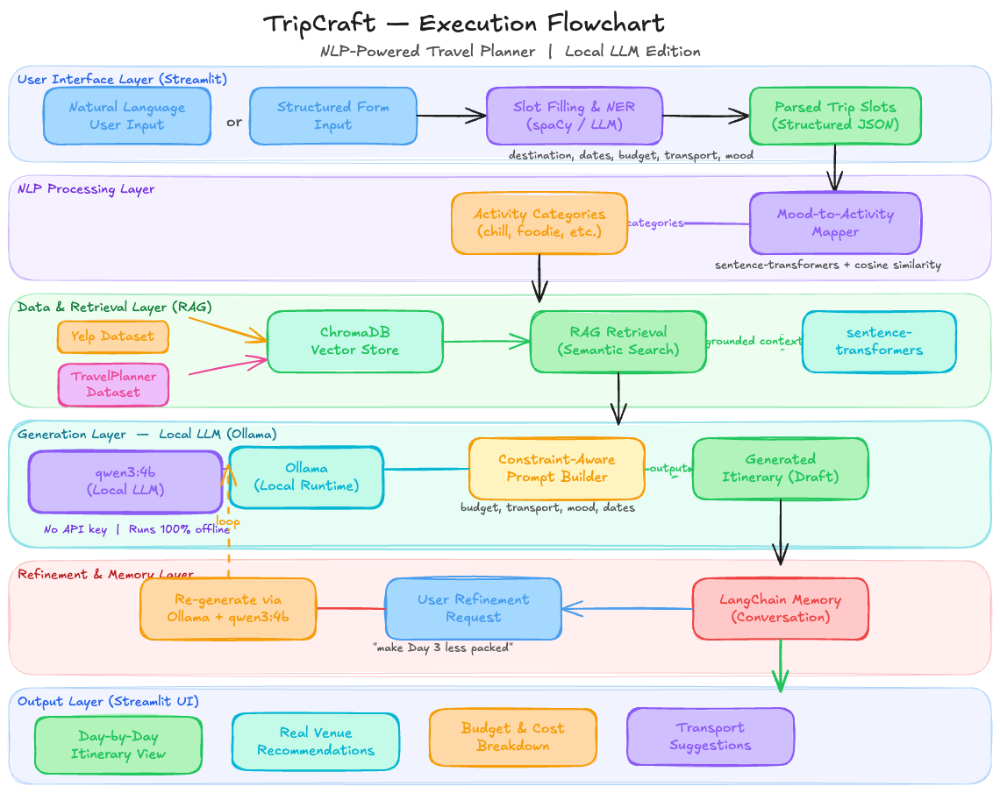

# **NLPilot 🧳✈️**

> An NLP-powered travel planner that converts your preferences — destination, budget, mood, dates, and transport — into a personalized day-by-day itinerary. Built with a fully local RAG pipeline (Ollama + Llama 3 + ChromaDB), semantic mood-to-activity mapping, and real venue data from the Yelp Open Dataset. No API keys required — runs entirely on your machine.


---

## **📌 Overview**

NLPilot takes the hassle out of travel planning. Instead of spending hours researching places, manually budgeting, and building day schedules — just describe your trip in natural language and NLPilot generates a complete, grounded itinerary tailored to you.

> ⚙️ **Fully Local** — No API keys, no cloud services, no internet required after setup. Every component runs on your machine.

**Example Input:**

> _"I'm flying from San Francisco to New York for 5 days with a $2,000 budget. I prefer public transport, and I'm in the mood for art, local food, and some chill walks."_

**Example Output:**
A full 5-day itinerary with morning/afternoon/evening slots, real venue recommendations, estimated costs per day, and transport suggestions — all within your budget.



---

## **🧠 NLP Pipeline**

```
User Input (Natural Language / Form)
        ↓
  Slot Filling & NER (spaCy)
  [destination, dates, budget, transport, mood]
        ↓
  Mood-to-Activity Mapping
  [sentence-transformers + cosine similarity]
        ↓
  RAG Retrieval (ChromaDB + Yelp Open Dataset)
  [local vector store — no API needed]
        ↓
  Itinerary Generation (Ollama — Llama 3 local)
  [constraint-aware, structured prompting]
        ↓
  Multi-turn Refinement
  [conversational edits via LangChain memory]
        ↓
  Output: Day-by-day itinerary (Streamlit UI)
```

---

## **✨ Features**

- 🗓️ **Day-by-day itinerary generation** from natural language or form input
- 🎭 **Mood-to-activity mapping** — maps vague descriptors like _"chill"_ or _"adventurous"_ to concrete activity categories using sentence embeddings
- 📍 **Real venue recommendations** grounded via Yelp Open Dataset loaded into ChromaDB
- 💰 **Budget & transport constraint enforcement** — stays within your limits
- 💬 **Multi-turn refinement** — tweak your plan conversationally (e.g., _"make Day 3 less packed"_)
- 🔍 **RAG-powered grounding** to minimize hallucinations
- 🔒 **Fully local** — no API keys, no cloud dependencies

---

## **🛠️ Tech Stack**

| **Layer**     | **Tool**                      |
| ------------- | ----------------------------- |
| LLM           | Llama 3 via Ollama (local)    |
| Orchestration | LangChain                     |
| Vector Store  | ChromaDB (local)              |
| Embeddings    | sentence-transformers (local) |
| NLP / NER     | spaCy                         |
| Venue Data    | Yelp Open Dataset (local)     |
| Frontend      | Streamlit                     |
| Language      | Python 3.10+                  |

---

## **🚀 Getting Started**

### **1. Clone the Repository**

```bash
git clone https://github.com/Aayush99000/NLPilot.git
cd NLPilot
```

### **2. Create a Virtual Environment**

```bash
python -m venv venv
source venv/bin/activate  # Windows: venv\Scripts\activate
```

### **3. Install Dependencies**

```bash
pip install -r requirements.txt
```

### **4. Install Ollama & Pull Llama 3**

```bash
# Install Ollama from https://ollama.com
# Then pull the model — this is a one-time download (~4.7 GB)
ollama pull llama3
```

> 💡 Make sure Ollama is running in the background before starting the app:
>
> ```bash
> ollama serve
> ```

### **5. Download the Yelp Open Dataset**

- Go to 🔗 [yelp.com/dataset](https://business.yelp.com/data/resources/open-dataset/)
- Fill in the short form and download the `.tar` file
- Extract and place the JSON files in `data/raw/yelp/`

### **6. Download TravelPlanner Dataset**

```bash
# Download directly using wget
wget -P data/raw/travelplanner/ https://huggingface.co/datasets/osunlp/TravelPlanner/resolve/main/train/train.jsonl
wget -P data/raw/travelplanner/ https://huggingface.co/datasets/osunlp/TravelPlanner/resolve/main/validation/validation.jsonl
```

### **7. Preprocess the Datasets**

```bash
python data/fetch_datasets.py \
    --yelp_dir data/raw/yelp \
    --travelplanner_dir data/raw/travelplanner \
    --output_dir data/processed
```

### **8. Ingest into ChromaDB**

```bash
python pipeline/ingest_chromadb.py --data_dir data/processed
```

### **9. Run the App**

```bash
streamlit run app.py
```

---

## **📁 Project Structure**

```
NLPilot/
├── app.py                        # Streamlit frontend
├── assets/
│   └── demo.png                  # Demo image for README
├── pipeline/
│   ├── slot_filler.py            # NER & structured input extraction
│   ├── mood_mapper.py            # Mood-to-activity semantic mapping
│   ├── retriever.py              # RAG retrieval from ChromaDB
│   ├── ingest_chromadb.py        # Loads processed data into ChromaDB
│   └── generator.py              # Local LLM itinerary generation (Ollama)
├── data/
│   ├── fetch_datasets.py         # Dataset fetching & preprocessing
│   ├── raw/
│   │   ├── yelp/                 # Raw Yelp JSON files
│   │   └── travelplanner/        # Raw TravelPlanner JSONL files
│   └── processed/                # Cleaned JSONL files ready for ingestion
├── vectorstore/                  # ChromaDB persistent local vector store
├── requirements.txt
└── README.md
```

---

## **⚙️ System Requirements**

| Component | Minimum                 | Recommended   |
| --------- | ----------------------- | ------------- |
| RAM       | 8 GB                    | 16 GB         |
| Storage   | 15 GB free              | 20 GB free    |
| Python    | 3.10+                   | 3.11+         |
| OS        | Windows / macOS / Linux | macOS / Linux |

> 💡 Llama 3 8B requires at least 8 GB RAM to run locally via Ollama.

---

## **📊 Evaluation**

NLPilot is evaluated on:

- **Constraint Satisfaction Rate** — how well the itinerary respects budget and transport inputs
- **BERTScore** — semantic similarity of generated itineraries vs. reference travel blogs
- **Human Preference Scoring** — user ratings on relevance, coherence, and personalization

---

## **📄 License**

This project is licensed under the MIT License. See [LICENSE](LICENSE) for details.

---

## **🙋 Authors**

**Aayush** — MS Data Science, Northeastern University  
**Kaushal** — MS Data Science, Northeastern University
